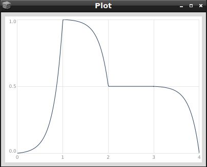

# Hüllkurven (Envelopes)

In der Audio-Terminologie bezeichnet der Begriff "Envelope" einen anpassbaren Parameter, der im Laufe der Zeit einen spezifischen Aspekt eines Klanges modifiziert. Envelope-Generatoren in Synthesizern werden dazu verwendet, das Verhalten eines Klangs während seiner Wiedergabe zu definieren.

In SuperCollider erstellen wir eine Hüllkurve mit der Klasse `Env`. Ein `Env` benötigt zwei wichtige Argumente: Zum einen die Zielwerte der einzelnen Segmente (`levels`) und zum anderen die Dauer, die jedes Segment haben sollte (`times`). Schauen wir uns eine solche einfache Hüllkurve an:

```
Env(levels: [0, 1, 0], times: [1, 1]).plot
```


Diese Hüllkurve generiert eine Reihe von Zahlen auf folgende Weise:

Wir starten mit dem Wert 0 (auf der y-Achse dargestellt) zur Zeit 0 (Startzeit, auf der x-Achse dargestellt). Die Hüllkurve erreicht den Wert 1 nach 1 Sekunde und kehrt innerhalb weiterer 1 Sekunde zum Wert 0 zurück.

Wir können die oben beschriebene Hüllkurve nutzen, um den Klang unseres selbstgebauten Instruments (den wir bisher nur mit der `free` Methode oder durch **Ctrl+.** abgeschaltet haben) zeitlich und hinsichtlich der Lautstärke zu modulieren. An dieser Stelle ist es wichtig zu beachten, dass die Klasse `Env` lediglich die Form unserer Hüllkurve gestaltet. Um aus dieser einfachen Form einen Hüllkurvengenerator für unsere Instrumente auf dem Server zu erstellen, müssen wir die Form der Hüllkurve an einen Envelope Generator senden. Dies geschieht mit der Klasse `EnvGen` (Envelope Generator), und wir schreiben dazu:
```
EnvGen.kr(Env([0, 1, 0], [1, 1]), doneAction: 2);
```
__Anmerkung__ Das Argument `doneAction` des Hüllkurvengenerators informiert den Server darüber, dass der Speicherplatz für den Generator (und die damit verbundenen UGen) freigegeben werden soll, sobald die Hüllkurve ihren Verlauf beendet hat.

Wir integrieren diese Hüllkurve in unser zuvor definiertes Instrument (`\meinSynth`). Um den Lautstärkenverlauf des Synthesizers zu beeinflussen, multiplizieren wir die Werte der Hüllkurve mit den Ausgangswerten des Sinus-Oszillators:
```
(
SynthDef(\meinSynth, {
    arg freq=440, amp=0.2, kanal=0, dur=1;
	var halfDur = dur * 0.5;
	var env = EnvGen.kr(Env([0, amp, 0], [halfDur, halfDur]), doneAction: 2);
    Out.ar(kanal, SinOsc.ar(freq: freq, mul: env))
}).add
)
```
Hier wird die Hüllkurve auf die Gesamt-Amplitude des Synthesizers angewendet, um den Lautstärkenverlauf zu gestalten. Der Sinus-Oszillator wird mit den skalierten Amplitudenwerten der Hüllkurve moduliert. Beachten Sie, dass wir hier auch die Dauer unseres Instrumentenklangs eingeführt haben, da diese jetzt mithilfe der Hüllkurve sehr leicht bestimmbar ist!

**Übung** Probieren Sie das neu gebaute Instrument mit unterschiedlichen Parametern aus.

Beachten Sie, dass das Argument `doneAction` des Hüllkurvengenerators (`EnvGen`) dafür sorgt, dass der gesamte Synthesizer vom Server freigegeben wird, sobald die Hüllkurve abgelaufen ist. Sie können dies unten rechts im Editor beobachten:


**Übung:** Die `Env`-Klasse definiert eine Reihe von Hüllkurvenformen wie `sine`, `perc`, `triangle` und `linen`. Schauen Sie sich diese Env-Methoden in der Dokumentation an. Setzen Sie diese Methoden in das Instrument ein und beobachten Sie den Unterschied. Versuchen Sie, dem Synthesizer Argumente zu geben, die Sie für diese Methoden verwenden können.

Wenn man von Hüllkurven spricht, assoziiert man sie oft mit den Abkürzungen [ADSR](https://de.wikipedia.org/wiki/ADSR). Die sogenannte Attack-Decay-Sustain-Release-Hüllkurve lässt sich in SuperCollider leicht erzeugen. Dazu benötigen wir einen Anfangswert, einen Höchstwert (Peak), einen Sustain-Wert und einen Endwert:
```
Env([0, 1, 0.5, 0.5, 0], [1, 1, 1, 1]).test.plot;
```


Über das dritte Argument des `Env` können wir weitere Feineinstellungen in unserer Hüllkurve vornehmen. Mit dem Argument `curve` können wir die Gestaltung einzelner Segmente beeinflussen. Dieses Argument kann entweder eine Zahl sein, wobei die Zahl 0 eine gerade Linie repräsentiert, positive Zahlen eine Krümmung nach rechts und negative Zahlen eine Krümmung nach links darstellen. Je höher die Zahl ist, desto stärker wird die Krümmung des Segments sein:
```
Env([0, 1, 0.5, 0.5, 0], [1, 1, 1, 1], curve: 5).test.plot
```


```
Env([0, 1, 0.5, 0.5, 0], [1, 1, 1, 1], curve: -5).test.plot
```


Wir haben auch die Möglichkeit, die Krümmung der Segmente unabhängig voneinander zu gestalten, indem wir sie in einem Array definieren:
```
Env([0, 1, 0.5, 0.5, 0], [1, 1, 1, 1], curve: [5, -5, 0, 4.5]).test.plot
```


Eine andere Möglichkeit, die Krümmung unserer Hüllkurve zu bestimmen, besteht darin, eine der vordefinierten Formen (als Symbole) zu verwenden. Diese sind: `\step`, `\hold`, `\linear`, `\exponential`, `\sine`, `\welch`, `\squared` oder `\cubed`.

**Übung** Schauen Sie sich die Definitionen dieser Krümmungsformen in der Dokumentation an. Setzen Sie diese Formen in das folgende Env ein und beurteilen Sie die Unterschiede im Klang:
```
{Saw.ar(100, EnvGen.kr(Env([0.001, 0.5, 0.001], curve: ), doneAction: 2))}.play
```

**Übung** Nutzen Sie die Iterationsmöglichkeiten, die wir im Kapitel [Iteration mit Do und Collect](https://teymuri.github.io/musikelektronik/lang/#iterieren-mit-do-und-collect) gelernt haben, um einen C-Dur-Akkord mit dem neuen Instrument `\meinSynth` abzuspielen.

