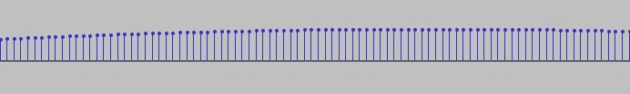

# Die ersten Töne

## Starten des Servers
Im letzten Kapitel haben wir uns mit der Sprache SuperCollider beschäftigt. Die Sprache allein kann keinen Klang erzeugen, sondern ist lediglich für die Weitergabe unserer Befehle an den Klang-Server verantwortlich. Um unseren ersten Ton in SuperCollider zu erzeugen, müssen wir zuerst den Server starten. Erinnern wir uns daran, dass die Einzelvariabel "s" für den Server steht. Mit dem Aufrufen des `boot`-Befehls starten wir ihn:

```
s.boot;
```
## Der Klang der Sinusschwingung (`Hello World!`)
Aus historischen Gründen werden in SuperCollider auch die Objekte, die für die Klangerzeugung verantwortlich sind, als "UGen" bezeichnet. Eine dieser UGens ist SinOsc, die eine einfache Sinusschwingung generiert (Ein schöner (und historischer) Artikel bezüglich des Sinustons von [Herbert Eimert](https://de.wikipedia.org/wiki/Herbert_Eimert) ist [hier](pdf/eimert_sinus-ton.pdf) verlinkt). Die meisten UGens in SuperCollider benötigen Informationen von uns (ähnlich wie Argumente in Funktionen im letzten Kapitel). Zum Beispiel benötigt unser SinOsc UGen folgende Eingaben: Frequenz, Phase, Amplitude und DC-Offset. Geben Sie den folgenden Code in Ihren SuperCollider-Editor ein. Sobald Sie die Klammer öffnen, sollten Sie diese Argumente sehen können. Achten Sie darauf, dass diese Argumente auch Standardwerte haben, so dass, wenn wir keine Informationen bereitstellen, diese Standardwerte übernommen werden:

```supercollider
SinOsc.ar();
```
(Tipp: Wenn die Argumentenliste nicht angezeigt wird, kann man sie durch Drücken der Tastenkombination **Shift+Ctrl+L** wieder einblenden.)

Im Kontext von SuperCollider steuern die Argumente des SinOsc (Sinus Oszillator) die Eigenschaften der erzeugten Sinusschwingung. Hier sind die Argumente:

1. **Frequenz (freq):** Dies bestimmt, wie viele Schwingungen pro Sekunde erzeugt werden. Eine höhere Frequenz erzeugt einen höheren Ton.

2. **Phase (phase):** Die Phase gibt den Startpunkt der Sinusschwingung an. Eine Phase von 0 bedeutet, dass die Schwingung bei null Grad beginnt.

3. **Amplitude (mul):** Die Amplitude beeinflusst die Höhe der Schwingung und damit die Lautstärke des Tons. Eine höhere Amplitude erzeugt einen lauter klingenden Ton (Werte zwischen 0 und 1).

4. **DC-Offset (add):** Dies ist eine konstante Spannung, die zur Sinuswelle hinzugefügt wird. Sie beeinflusst den Grundpegel der Welle und kann dazu verwendet werden, sicherzustellen, dass die Welle um den Nullpunkt zentriert ist oder einen bestimmten Ausgangspunkt hat.

Der Code `SinOsc.ar()` erzeugt standardmäßig eine Sinusschwingung mit den Standardwerten für Frequenz, Phase, Amplitude und DC-Offset. Wenn Sie spezifische Werte angeben möchten, können Sie sie als Argumente im SinOsc-Objekt setzen, z.B. `SinOsc.ar(440, 0, 0.5, 0)`, wobei 440 die Frequenz, 0 die Phase, 0.5 die Amplitude und 0 das DC-Offset ist.

Um nun den Klang einer 440-Hz-Frequenz zu hören, müssen wir unsere UGens in eine Funktion einbetten und die `play`-Nachricht an diese Funktion senden. Dadurch wird die enthaltene UGen an den Server gesendet, und wir können etwas hören.

Bevor wir weitermachen und den ersten Sinuston an den Server senden, ist es wichtig zu wissen, wie wir den Ton wieder ausschalten können. Merken Sie sich die Tastenkombination **Ctrl+.**
Dies deaktiviert den Server, und wir nutzen momentan diese Methode, um den Ton schnell auszuschalten.

Schreiben Sie nun den folgenden Code-Block und führen Sie ihn aus (mit dem Cursor innerhalb des Blocks **Ctrl+Enter** drücken):

```supercollider
{SinOsc.ar(440, 0, 0.5, 0)}.play;
```
Stoppen Sie den Server mit **Ctrl+.** und lassen Sie uns den obigen Code etwas genauer betrachten.

Wir öffnen zuerst mit den runden Klammern einen Block. Dies ist praktisch, wenn unser Code über mehrere Zeilen geht, damit wir alle Zeilen auf einmal auswerten können.

```supercollider
()
```

Als Nächstes öffnen wir ein paar geschweifte Klammern, um eine anonyme Funktion zu definieren. Sie ist anonym, weil wir diese Funktion nur an dieser Stelle als Beispiel verwenden und ihr keinen Namen geben:

```supercollider
({})
```

Innerhalb unserer Funktion schreiben wir unsere UGen mit den gewünschten Argumenten:

```supercollider
({SinOsc.ar(440, 0, 0.5, 0)})
```

Auf das Objekt SinOsc wenden wir die Nachricht `ar` an, die für Audio Rate steht. Die `ar`-Funktion sorgt dafür, dass die Sample-Ausgaben der UGen (hier SinOsc) in einer Audiorate (oft 44100 Mal pro Sekunde) vom Server an die Audiokarten unseres Rechners geschickt werden. Von dort werden diese Samples (die im Prinzip nichts anderes sind als Dezimalzahlen) an einen sogenannten DAC (Digital Audio Converter) geschickt, um dann als Spannungsvariationen (nach eventueller Verstärkung) an Lautsprecher gesendet zu werden. Wichtig ist auch zu verstehen, dass die `ar`-Methode gleichzeitig eine Instanz der SinOsc-Klasse generiert.

Wenn wir an dieser Stelle unseren Code-Block auswerten, sehen wir im Post-Fenster, dass er zu einer Funktion evaluiert wurde (`-> a Function`).

Jetzt können wir unsere Funktion an den Server senden. Dafür rufen wir die `play`-Methode auf die Funktion auf. Was wir hier über die `play`-Methode einer Funktion wissen müssen: `play` generiert auf dem Server einen sogenannten Synth. Synths sind die Klanggeneratoren auf der Server-Seite. Diese Synth wird nach der Erstellung zum Klingen gebracht:

```supercollider
({SinOsc.ar(440, 0, 0.5, 0)}.play)
```

Wenn wir die tatsächliche Synth, die für uns von `play` generiert wurde, weiterhin kontrollieren möchten (der serverinterne Name wird im Post-Fenster nach dem Auswerten der obigen Zeile angezeigt), können wir ganz einfach die ausgegebene Synth einer Variable zuweisen:

```supercollider
(x = {SinOsc.ar(440, 0, 0.5, 0)}.play)
```

Jetzt enthält `x` die Synth, und wir können sie zum Beispiel über die Variable `x` ausschalten, indem wir der Variable `x` die Nachricht `free` senden:

```
x.free;
```
Das ist praktisch, da wir mit `free` nur diese eine Synth-Instanz abschalten können (im Unterschied zu unserer vorherigen Lösung **Ctrl+.**, die den kompletten Server herunterfährt).

Wir können unserer Funktion Argumente hinzufügen, sodass wir die Parameter unseres SinOsc explizit eingeben können:

```supercollider
(
x = {
	arg freq = 100, amp = 0.5;
	SinOsc.ar(freq, mul: amp)
}
)
```

So können wir durch die `set`-Methode unserer Synth-Instanzen die Frequenz oder die Amplitude neu setzen, und das während der Synth läuft (also während unser Sinuston weiter erklingt):
```
// Wir können uns den Plot unserer Funktion ansehen 
// (für 0.1 Sekunden, was mit unserer Funktionsfrequenz von 100 Hz 10 Schwingungsperioden entspricht)
x.plot(0.1);
```


**Übung: **Versuchen Sie, verschiedene Parameter einer Funktion mit einer Sinus-Schwingung zu verändern (z.B. Phase, Amplitude, Offset) und verfolgen Sie die Unterschiede im resultierenden Plot.
```supercollider
// Funktion abspielen
// Den resultierenden Prozess in einer Variablen speichern
y = x.play;

// Amplitude halbieren
y.set(\amp, 0.25);

// Die Frequenz um eine Oktave tiefer spielen
y.set(\freq, 220);

// Und den Prozess ausschalten
y.free;
```

## Verschachtelung der UGens
Das Verständnis eines Prinzips ist hier von Bedeutung: auch die UGens (wie alles andere auf unserem Rechner!) arbeiten ausschließlich mit Zahlen! Das bedeutet, ihre Ausgabe besteht ausschließlich aus Zahlen.
Wenn wir in eine Sinusschwingung in einem DAW-Programm (hier [Audacity](https://www.audacityteam.org/)) ausreichend hineinzoomen, können wir die einzelnen Sample-Werte (die Amplitudenwerte unseres Sinustons, Dezimalzahlen) sehen:


Da die UGens schließlich nur Zahlen ausgeben, können wir sämtliche mathematische Funktionen, die wir auf Zahlen anwenden können, auch auf UGens anwenden. Schauen Sie sich das folgende Beispiel an und erklären Sie, was Sie im Post-Fenster sehen:

```supercollider
{(SinOsc.ar(1).poll(label: \Sin) * 10).poll(label: \SinX10)}.play
```


Diese Eigenschaft der UGens ermöglicht es uns, eine weitere UGen als Argument für unsere SinOsc UGen einzusetzen. Dadurch wird ein kontinuierlicher Datenstrom an Zahlen an die Haupt-UGen gesendet, die dann als Frequenz (oder auch andere Parameter) interpretiert werden können. Ein Beispiel:

```supercollider
(
    { SinOsc.ar(SinOsc.kr(1, mul: 100, add: 400)) }.play
)
```

Dieses Beispiel demonstriert, wie eine Sinus-Oszillation (SinOsc) mit einer anderen Sinus-Oszillation als Modulator für ihre Frequenz verwendet werden kann.

Lassen Sie uns dieses Beispiel etwas genauer unter die Lupe nehmen:

Das innere `SinOsc` fungiert hier als Frequenzmodulator. Ein `SinOsc` generiert Dezimalzahlen zwischen -1 und 1 mit einer bestimmten Frequenz. Diese Zahlen werden mit 100 multipliziert, um den Bereich auf -100 bis 100 zu skalieren. Danach wird 400 dazu addiert, um den Wertebereich zu verschieben. Dies führt zu einem Glissando-Effekt im Bereich zwischen 300 Hz und 500 Hz (Achtung: die Multiplikation erfolgt vor der Addition). Das gleiche Ergebnis kann durch Senden der Nachricht `range` an den Zahlenstrom des inneren `SinOsc` mit den Argumenten 300 und 500 erreicht werden (Mit dem Cursor auf dem Wort "range" drücken Sie die Tastenkombination **Ctrl+D**, um die Dokumentationsseite über `range` zu öffnen. Dort können Sie unter verschiedenen Einträgen auf **UGen** klicken, um weitere Informationen über `range` zu erhalten):
```
(
    { SinOsc.ar(SinOsc.kr(1).range(300, 500) * 100 + 400) }.play;
)
```

**Übung: LFO-Modulation der Frequenz**
Modulieren Sie die Frequenz eines Sinus-Oszillators mit einem LFO (Low-Frequency Oscillator) im Bereich 100 Hz - 300 Hz.
Sie dürfen die Frequenz des LFO bestimmen. Verwenden Sie einen LFO um unterschiedliche Parameter einesOszillators zu
modulieren.


## Mehrkanal-Erweiterung

Viele UGens in SuperCollider unterstützen eine Eigenschaft namens [Multiple Dispatching](https://de.wikipedia.org/wiki/Multimethode). Was dies vereinfacht bedeutet, ist, dass das Verhalten der UGens je nach Typ ihrer Argumente unterschiedlich sein wird. Zum Beispiel können wir einem Sinus-Oszillator nicht nur eine Zahl als Argument für einen seiner Parameter angeben, sondern auch ein Array von Zahlen. Was dann passiert, ist, dass SuperCollider die Angabe des Arrays als Argument interpretiert, als eine Liste von Ausgängen (z.B. eine Liste von Lautsprechern), und generiert so viele Signale wie die Größe des Arrays und sendet sie an die Lautsprecher. Schauen wir uns dazu ein Beispiel an, indem wir ein Signal-Array vom selben Sinus-Oszillator mit unterschiedlichen Amplituden generieren. Dazu betrachten wir den sogenannten "Server Meter", der uns die Signalwege In und Out vom SuperCollider-Server anzeigt. Drücken Sie die Tastenkombination **Ctrl-M** oder klicken Sie im Editor unter dem Server-Menu auf **Server > Show Server Meter**.


Jetzt evaluieren Sie folgenden Code:
```supercollider
(
{
    SinOsc.ar(200, mul: [0.01, 0.3])
}.play;
)
```


**Übung: Beschreibung**
Erklären Sie, was Sie im Server Meter sehen, und den Grund dafür.

**Übung: Generierung eines Intervals**
Generieren Sie ein Quint-Intervall mit den beiden Tönen A (440 Hz) und der Quinte darüber. 
Senden Sie an Ihre Funktion statt `play` die Nachricht `value`, um die Funktion zu evaluieren, anstatt den Ausgabewert an den Server für Klanggenerierung zu leiten.
Die Ausgabe ist ein Array von UGens.

Beachten Sie, dass es in diesem Kontext ausreicht, wenn eines der Argumente anstelle einer Zahl ein Array ist, um eine entsprechende Array von Ausgängen zurückzubekommen.
Wenn ein Array mit 2 Zahlen als Argument an unsere UGen übergeben wird, resultiert dies in einem Array mit zwei Kopien derselben UGen.

Achten Sie darauf, dass das Ergebnis des obigen Codes exakt gleich dem unteren ist:
```
(
{
    var sig = SinOsc.ar(200);
	// Das Signal als ein Array an den Server senden.
	// Der Server wird dann die Signale in einem Array an
	// physikalischen Ausgängen (Lautsprechern) abbilden,
	// so dass das erste Signal am Lautsprecher 1, das
	// zweite am Lautsprecher 2 usw. gesendet wird.
	[sig * 0.01, sig * 0.3]
}.play;
)
```
*Fazit: Der Server interpretiert ein Array als Mehrkanalklang.*

Es gibt verschiedene syntaktische Möglichkeiten, UGens zu vervielfältigen. Einige dieser Möglichkeiten sind hier aufgelistet:

Die `dup` Funktion erhält zwei Argumente: ein Element und die Anzahl, wie oft dieses Element vervielfältigt werden soll (nennen wir diese Anzahl N). Sie gibt ein N-Tuple-Array mit Kopien des Elements zurück:

```supercollider
"Ein String".dup() // -> [ EinString, EinString ]
SinOsc.ar.dup(2) // -> [ SinOsc, SinOsc ]
```

Eine alternative Schreibweise für `dup` ist der Duplizierungsoperator `!`:

```supercollider
"Ein String" ! 2 // -> [ EinString, EinString ]
SinOsc.ar ! 2 // -> [ SinOsc, SinOsc ]
```
