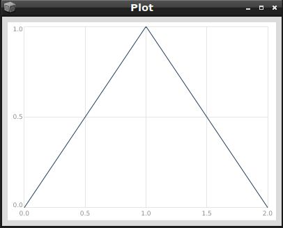
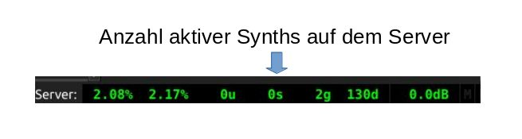
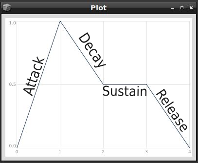
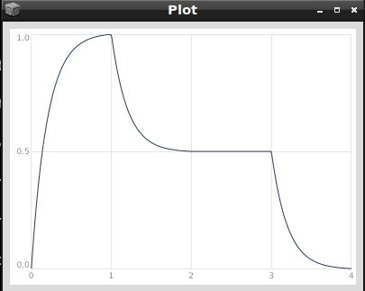
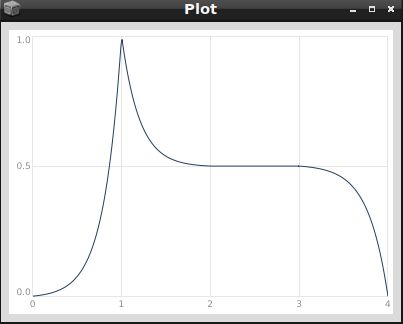

# Instrumente definieren mit SynthDef
## Einführung in Synth
In diesem Kapitel lernen wir die Kernelemente der Klanggenerierung auf dem SuperCollider-Server kennen. Diese tragen den Namen "Synth" (für Synthesize). Jedes Mal, wenn wir in unserem letzten Kapitel eine Funktion mit einer SinOsc UGen abgespielt haben, hat der SuperCollider-Server hinter den Kulissen einen Synth generiert. Das konnten wir auch im Post-Fenster sehen, wenn wir auf unsere Funktion die Methode `play` angewendet haben:

```supercollider
{SinOsc.ar(mul: 0.2)}.play
```

Im Post-Fenster sehen wir etwas wie **-> Synth('temp__0' : 1000)**, eine Darstellung des frisch für uns generierten Synths, der hier den Namen `temp__0` und eine ID-Nummer 1000 trägt (Dies kann bei Ihnen anders aussehen).

Wenn wir unsere Funktionsargumente definieren, können wir mit dem entstehenden Synth kommunizieren:

```supercollider
y = {arg freq=440, amp=0.2; SinOsc.ar(freq: freq, mul: amp)}.play
```

Eine Veränderung der Frequenz:

```supercollider
y.set(\freq, 330)
```

oder Veränderung der Amplitude:

```supercollider
y.set(\amp, 0.2)
```

können wir durch die `set` Methode der Synth-Klasse vornehmen.

Wir lassen unseren Synth geschmeidig über eine Sekunde ausklingen:

```supercollider
y.release(1)
```

Wir definieren einen ähnlichen Synth selbst! Das Erstellen von Synths geschieht durch die SynthDef-Klasse, wie folgt. Evaluieren Sie den folgenden Block. Im Post-Fenster sehen wir, dass unser Synth erfolgreich für den Server definiert wurde (`-> SynthDef:meinSynth`):

```supercollider
(
SynthDef(\meinSynth, {
	arg freq=440, amp=0.2;
	Out.ar(0, SinOsc.ar(freq: freq, mul: amp))
}).add
)
```

Ich gehe jede Zeile der obigen Synth-Definition durch:

```supercollider
(
// Mit der SynthDef-Klasse definieren wir den Synth. Das erste Argument ist der Name, den wir unserem
// Synth geben möchten (hier meinSynth). Dieses Argument kann entweder vom Typ Symbol sein (wie \meinSynth) oder ein String (wie "meinSynth").
SynthDef(\meinSynth,
	// Das zweite Argument ist eine Funktion, die definiert, wie wir Ugens zusammen kombinieren
	// möchten, um unser Instrument zu bauen.
	{
		// Argumente für die Funktion.
		arg freq=440, amp=0.2;
		// Es gibt hier einen großen Unterschied zu unserer {}.play Form früher. Da hatte für uns
		// SuperCollider entschieden, dass unser Signal zum ersten (linken) Kanal rausgeschickt wird.
		// Beim Definieren eines Instruments durch SynthDef müssen wir dem Instrument genau mitteilen,
		// zu welchem Ausgang unser Signal rausgeschickt werden soll. Dafür nutzen wir ein UGen
		// namens Out und instanzieren es mit der ar Methode. Das erste Argument dazu bestimmt
		// die Nummer des Ausgangskanals (mit 0 für ersten Kanal, 1 für zweiten Kanal usw.). Das
		// zweite Argument bestimmt das eigentliche Signal (also wie unser Instrument klingen wird).
		Out.ar(0, SinOsc.ar(freq: freq, mul: amp))
	}
	// Nachdem wir mit der Definition unserer Synth-Funktion fertig sind, müssen wir durch
	// die add Methode unser Instrument der Liste der für den Server bekannten Synths
	// hinzufügen:
).add
)
```

Ab jetzt können wir unser Instrument zum Erklingen bringen (wir geben unserer Synth-Instanz den Namen `x`, damit wir die Parameter des Instruments mit `set` modifizieren können). Dafür schreiben wir:

```supercollider
x = Synth(\meinSynth)
x.set(\freq, 220)
x.set(\amp, 0.1)
x.free

x.defName // -> meinSynth
```

Sinnvollerweise sind wir in der Lage, den Ausgangskanal (das erste Argument zu dem Out Ugen) ebenfalls als ein Argument für unsere Synth-Funktion zu definieren. So können wir für jede einzelne Instanz unseres Instruments einen anderen physischen Kanal auswählen. Dafür modifiziere ich die obige Definition folgendermaßen:

```supercollider
(
SynthDef(\meinSynth, {
	arg freq=440, amp=0.2, kanal=0;
	Out.ar(kanal, SinOsc.ar(freq: freq, mul: amp))
}).add
)
```

Jetzt können wir das Signal von links nach rechts schicken:

```supercollider
x = Synth(\meinSynth)
x.set(\kanal, 1)
x.free
```

Die Synth-Klasse erlaubt es uns, die Argumente unserer Synth-Funktion schon beim Kreieren des Instruments zu übergeben. Dafür übergeben wir als das zweite Argument zum Synth ein Array mit Namen der Funktionsargumente (als Symbole oder Strings) und die Werte, getrennt durch Komma:

```supercollider
Synth(\meinSynth, [\freq, 220, \amp, 0.1, \kanal, 1])
```

Wir können durch mehrere Instanzen unseres Instruments mit jeweils unterschiedlichen Parametern erstellen.

**Übung:** Evaluieren Sie den folgenden Block. Versuchen Sie zu beschreiben, was dort passiert:

```supercollider
(
var n = 40;
n.do {
	arg x;
	Synth(\meinSynth, [\freq, 220 + (x * 2), \amp, n.reciprocal, \kanal: 0.rrand(1)])
}
)
```

**Übung:** Interferenz zweier naher Frequenzen

Nutzen Sie unser Wissen aus dem letzten Kapitel über die Mehrkanalerweiterung, um ein Instrument zu definieren, das auf den rechten und linken Kanälen zwei leicht unterschiedliche Frequenzen erklingen lässt. Verwenden Sie dafür den UGen "Saw" (ein Sägezahn-Oszillator). Verwenden Sie für den linken Kanal eine Frequenz von 40 Hz und auf dem rechten Kanal eine Frequenz von 41 Hz. Setzen Sie die Amplitude des Sägezahns auf den Wert 0.2.


## Hüllkurven (Envelopes)

In der Audio-Terminologie bezeichnet der Begriff "Envelope" einen anpassbaren Parameter, der im Laufe der Zeit einen spezifischen Aspekt eines Klanges modifiziert. Envelope-Generatoren in Synthesizern werden dazu verwendet, das Verhalten eines Klangs während seiner Wiedergabe zu definieren.

In SuperCollider erstellen wir eine Hüllkurve mit der Klasse `Env`. Ein `Env` benötigt zwei wichtige Argumente: Zum einen die Zielwerte der einzelnen Segmente (`levels`) und zum anderen die Dauer, die jedes Segment haben sollte (`times`). Schauen wir uns eine solche einfache Hüllkurve an:

```
Env(levels: [0, 1, 0], times: [1, 1]).plot
```


Diese Hüllkurve generiert eine Reihe von Zahlen auf folgende Weise:

Wir starten mit dem Wert 0 (auf der y-Achse dargestellt) zur Zeit 0 (Startzeit, auf der x-Achse dargestellt). Die Hüllkurve erreicht den Wert 1 nach 1 Sekunde und kehrt innerhalb weiterer 1 Sekunde zum Wert 0 zurück.

Wir können die oben beschriebene Hüllkurve nutzen, um den Klang unseres selbstgebauten Instruments (den wir bisher nur mit der `free` Methode oder durch **Ctrl+.** abgeschaltet haben) zeitlich und hinsichtlich der Lautstärke zu modulieren. An dieser Stelle ist es wichtig zu beachten, dass die Klasse `Env` lediglich die Form unserer Hüllkurve gestaltet. Um aus dieser einfachen Form einen Hüllkurvengenerator für unsere Instrumente auf dem Server zu erstellen, müssen wir die Form der Hüllkurve an einen Envelope Generator senden. Dies geschieht mit der Klasse `EnvGen` (Envelope Generator), und wir schreiben dazu:
```
EnvGen.kr(Env([0, 1, 0], [1, 1]), doneAction: 2);
```
(Das Argument `doneAction` des Hüllkurvengenerators informiert den Server darüber, dass der Speicherplatz für den Generator (und die damit verbundenen UGen) freigegeben werden soll, sobald die Hüllkurve ihren Verlauf beendet hat.)

Wir integrieren diese Hüllkurve in unser zuvor definiertes Instrument (`\meinSynth`). Um den Lautstärkenverlauf des Synthesizers zu beeinflussen, multiplizieren wir die Werte der Hüllkurve mit den Ausgangswerten des Sinus-Oszillators:
```
(
SynthDef(\meinSynth, {
    arg freq=440, amp=0.2, kanal=0, dur=1;
	var halfDur = dur * 0.5;
	var env = EnvGen.kr(Env([0, amp, 0], [halfDur, halfDur]), doneAction: 2);
    Out.ar(kanal, SinOsc.ar(freq: freq, mul: env))
}).add
)
```
Hier wird die Hüllkurve auf die Gesamt-Amplitude des Synthesizers angewendet, um den Lautstärkenverlauf zu gestalten. Der Sinus-Oszillator wird mit den skalierten Amplitudenwerten der Hüllkurve moduliert. Beachten Sie, dass wir hier auch die Dauer unseres Instrumentenklangs eingeführt haben, da diese jetzt mithilfe der Hüllkurve sehr leicht bestimmbar ist!

**Übung** Probieren Sie das neu gebaute Instrument mit unterschiedlichen Parametern aus.

Beachten Sie, dass das Argument `doneAction` des Hüllkurvengenerators (`EnvGen`) dafür sorgt, dass der gesamte Synthesizer vom Server freigegeben wird, sobald die Hüllkurve abgelaufen ist. Sie können dies unten rechts im Editor beobachten:




**Übung:** Die `Env`-Klasse definiert eine Reihe von Hüllkurvenformen wie `sine`, `perc`, `triangle` und `linen`. Schauen Sie sich diese Env-Methoden in der Dokumentation an. Setzen Sie diese Methoden in das Instrument ein und beobachten Sie den Unterschied. Versuchen Sie, dem Synthesizer Argumente zu geben, die Sie für diese Methoden verwenden können.

Wenn man von Hüllkurven spricht, assoziiert man sie oft mit den Abkürzungen [ADSR](https://de.wikipedia.org/wiki/ADSR). Die sogenannte Attack-Decay-Sustain-Release-Hüllkurve lässt sich in SuperCollider leicht erzeugen. Dazu benötigen wir einen Anfangswert, einen Höchstwert (Peak), einen Sustain-Wert und einen Endwert:
```
Env([0, 1, 0.5, 0.5, 0], [1, 1, 1, 1]).test.plot;
```


Über das dritte Argument des `Env` können wir weitere Feineinstellungen in unserer Hüllkurve vornehmen. Mit dem Argument `curve` können wir die Gestaltung einzelner Segmente beeinflussen. Dieses Argument kann entweder eine Zahl sein, wobei die Zahl 0 eine gerade Linie repräsentiert, positive Zahlen eine Krümmung nach rechts und negative Zahlen eine Krümmung nach links darstellen. Je höher die Zahl ist, desto stärker wird die Krümmung des Segments sein:
```
Env([0, 1, 0.5, 0.5, 0], [1, 1, 1, 1], curve: 5).test.plot
```


```
Env([0, 1, 0.5, 0.5, 0], [1, 1, 1, 1], curve: -5).test.plot
```


Wir haben auch die Möglichkeit, die Krümmung der Segmente unabhängig voneinander zu gestalten, indem wir sie in einem Array definieren:
```
Env([0, 1, 0.5, 0.5, 0], [1, 1, 1, 1], curve: [5, -5, 0, 4.5]).test.plot
```


Eine andere Möglichkeit, die Krümmung unserer Hüllkurve zu bestimmen, besteht darin, eine der vordefinierten Formen (als Symbole) zu verwenden. Diese sind: `\step`, `\hold`, `\linear`, `\exponential`, `\sine`, `\welch`, `\squared` oder `\cubed`.

**Übung** Schauen Sie sich die Definitionen dieser Krümmungsformen in der Dokumentation an. Setzen Sie diese Formen in das folgende Env ein und beurteilen Sie die Unterschiede im Klang:
```
{Saw.ar(100, EnvGen.kr(Env([0.001, 0.5, 0.001], curve: ), doneAction: 2))}.play
```

**Übung** Nutzen Sie die Iterationsmöglichkeiten, die wir im Kapitel [Iteration mit Do und Collect](https://teymuri.github.io/musikelektronik/lang/#iterieren-mit-do-und-collect) gelernt haben, um einen C-Dur-Akkord mit dem neuen Instrument `\meinSynth` abzuspielen.

## Sequenzierung mit Routine
Das Abspielen mehrerer Synth-Instanzen mit einfachen Iterationsmöglichkeiten wie `do` und `collect` führt zwangsläufig zu Akkorden, da wir mit `do`/`collect`-Konstruktionen keine Möglichkeit zum sequenziellen Abspielen der Synth-Instanzen haben (diese werden praktisch gleichzeitig ausgeführt). Mit der Klasse `Routine` können wir dies erreichen: Eine Routine ist im Grunde genommen eine Funktion, deren Ausführung wir mitten in der Aufführung für eine beliebige Zeit pausieren können.

Um eine Routine zu schreiben, müssen wir lediglich den Iterationscode innerhalb der Routine einsetzen und an der passenden Stelle bestimmen, wie lange unsere Routine nach jeder Iteration warten soll, bevor die nächste Iteration einsetzt. Dies geschieht mit Hilfe der `wait`-Methode. Am Ende müssen wir unsere fertige Routine mithilfe der `play`-Methode starten. Eine fertige Routine sieht folgendermaßen aus; hier spielen wir die ersten 20 Partialtöne der Grundfrequenz 110 Hz in einer Sequenz, wobei wir nach jedem Ton 150 Millisekunden warten (`0.15.wait`):

```
(
Routine {
	(Array.series(20, 1) * 110).do {
		arg freq;
		freq.postln;
		Synth(\meinSynth, [freq: freq, dur: 0.5]);
		0.15.wait
	}
}.play
)
```

**Übung** Verändern Sie die Parameter der obigen Routine, wie zum Beispiel das Array von Frequenzen, über das wir iterieren wollen. Passen Sie die Wartezeit der Routine an, sodass diese einen zufälligen Wert zwischen 100 Millisekunden und 500 Millisekunden annimmt (Stichwort `rrand`).